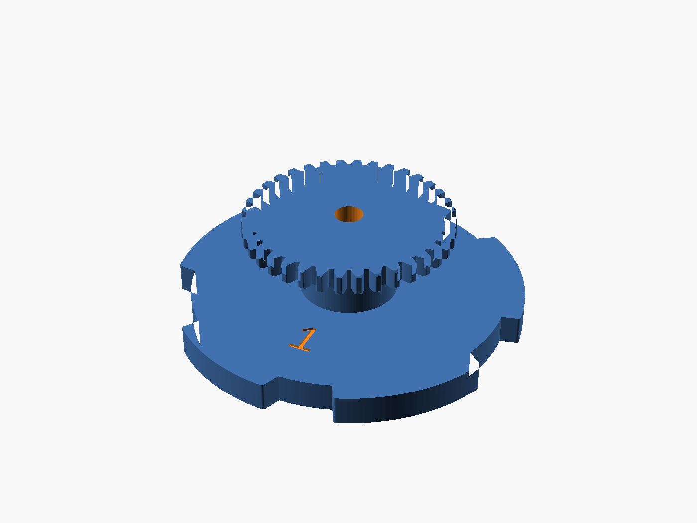
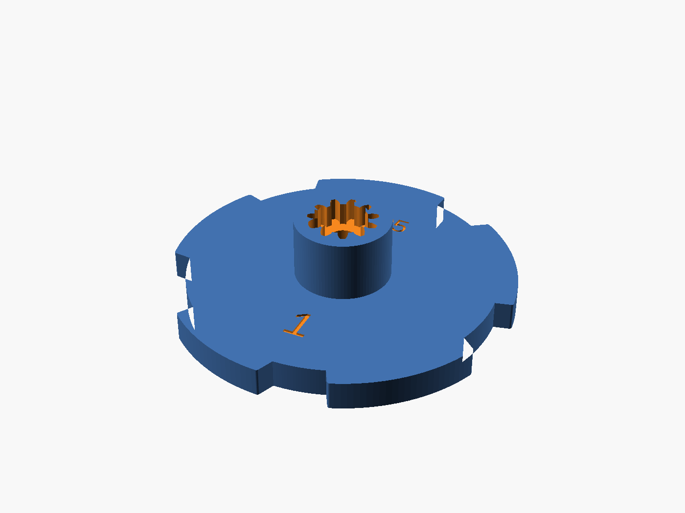
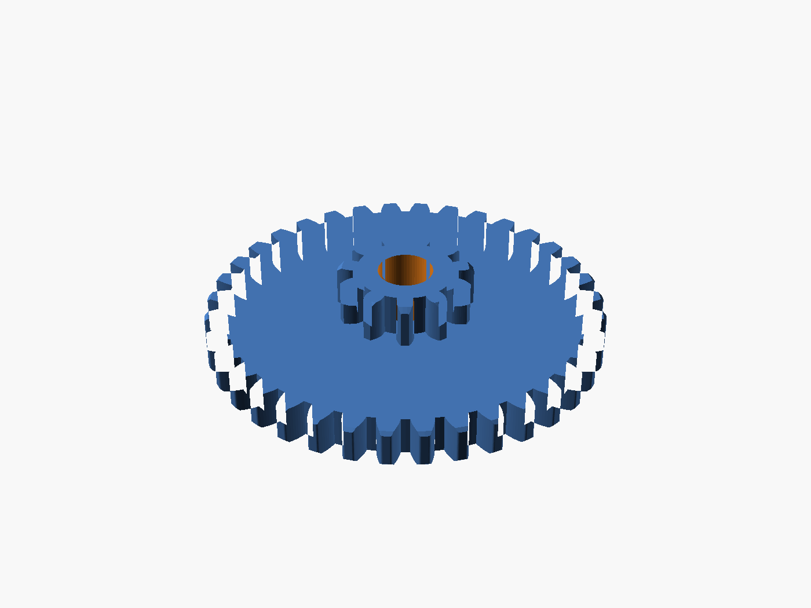
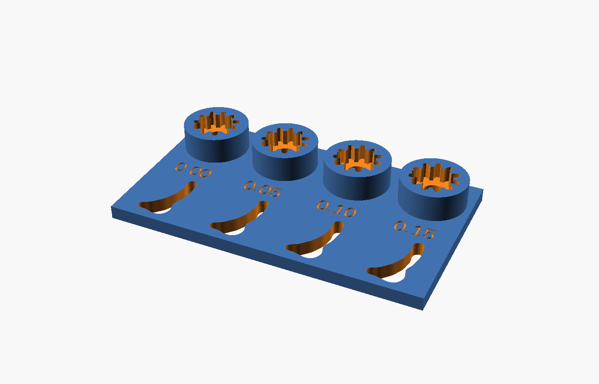
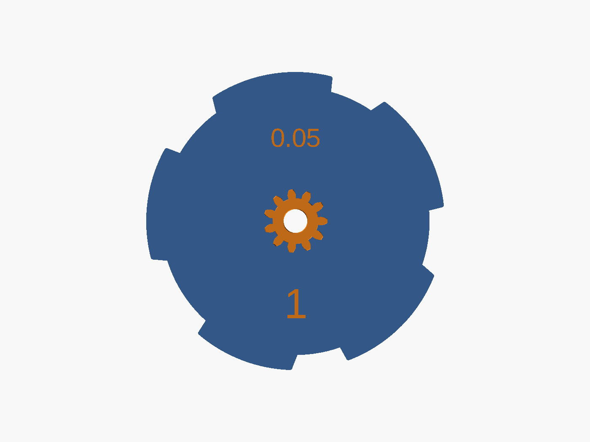
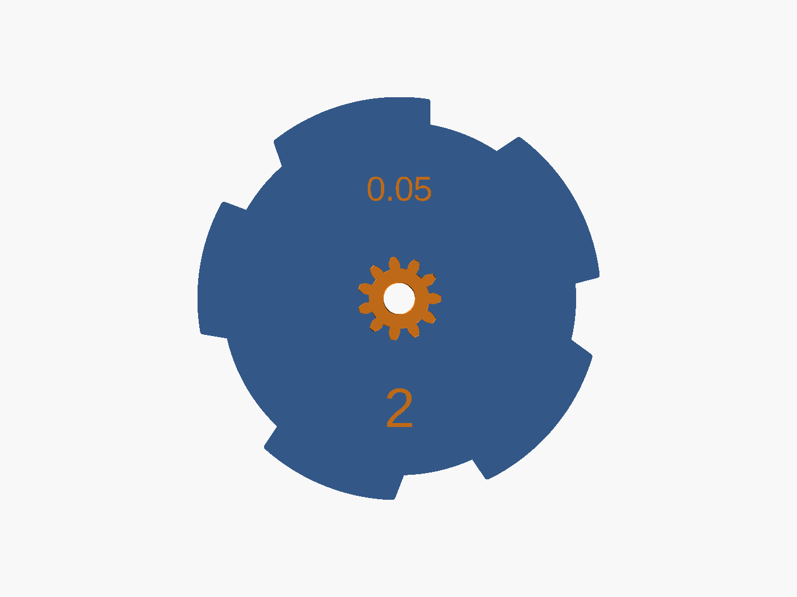
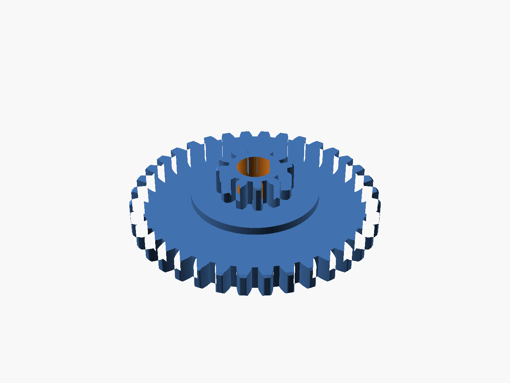
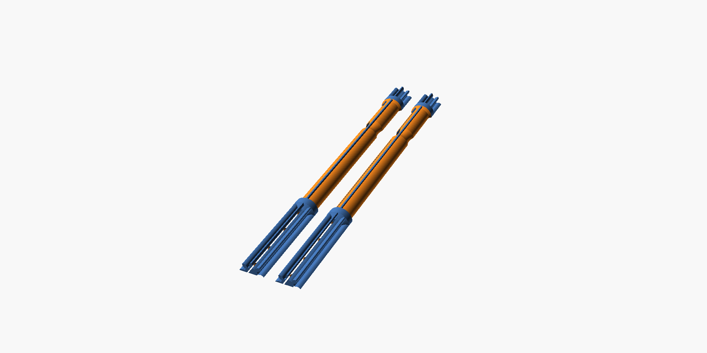

# Kreepy Krauly Dominator cam assembly

This project is a 3D printed replacement for the steering cam of the Kreepy Krauly Dominator pool cleaner. The design is parametric OpenSCAD. All dimensions are in `scad/config.scad`. You can change them in the OpenSCAD Customizer.

Words in this README have the meanings in `CONTEXT.md`.

| Cam assembly | Cam | Gear |
|---|---|---|
|  |  |  |

## Contents

1. [How the cam assembly works](#how-the-cam-assembly-works)
2. [The parts](#the-parts)
3. [Before you print: find the fit for your printer](#before-you-print-find-the-fit-for-your-printer)
4. [Modifiers: solid material where the parts wear](#modifiers-solid-material-where-the-parts-wear)
5. [Print the cam assembly](#print-the-cam-assembly)
6. [The two cam versions](#the-two-cam-versions)
7. [Optional gearbox parts](#optional-gearbox-parts)
8. [Change the design](#change-the-design)
9. [Where the numbers come from](#where-the-numbers-come-from)
10. [Open items](#open-items)

## How the cam assembly works

The cam assembly turns on a steel pin in the gearbox. The gearbox drives the gear. The gear turns the cam.

The cam has five lobes on the rim of its plate. A follower in the gearbox rides on the rim. When a lobe comes to the follower, the follower goes up the ramp face and onto the crest. At the end of the lobe, the follower falls off the drop face into the next trough. Each lift of the follower changes the direction of the cleaner.

The cam and the gear are two separate printed parts:

- The **plug** on the hub side of the gear has spline teeth.
- The **socket** in the top of the hub has the same spline teeth.
- You push the plug into the socket. The gear then seats on the **shoulder** of the hub.
- The spline teeth transmit the torque. The shoulder holds the gear at the correct height.

Because the gear is a separate part, you can print a new gear without a new cam. You can also print it in a different material.

The **washer** goes on the pin between the gearbox wall and the cam side of the plate. It sets the position of the cam on the pin.

## The parts

| Part | What it does | STL file |
|---|---|---|
| Cam | The plate with the lobes, the hub and the socket. The follower runs on it. | `stl/dominator_cam_v1.stl` or `stl/dominator_cam_v2.stl` |
| Gear | The 36 tooth gear with the plug. It drives the cam. | `stl/dominator_gear.stl` |
| Washer | Sets the position of the cam on the pin. | `stl/dominator_washer.stl` |
| Fit test | A test part to find the spline fit for your printer. | `stl/dominator_fit_test.stl` |

Each part also has one or more modifier files. The section [Modifiers](#modifiers-solid-material-where-the-parts-wear) tells you which modifier goes with which part.

## Before you print: find the fit for your printer

The plug must be tight in the socket. If it is loose, the joint has play and the teeth wear. If it is too tight, the hub can split. Each printer makes holes and teeth a little differently, so the correct fit is different on each printer.

One value controls the fit: `spline_clearance` in `scad/config.scad`. It is the gap between the plug and the socket, in mm, on all sides of each tooth.

**Only the socket changes with `spline_clearance`.** The plug is always the nominal spline size. Thus you print the gear one time, and then you use it to test sockets.

| Printer | Material | Best `spline_clearance` |
|---|---|---|
| Owner's Prusa MK4 | PETG | 0.05 (the default) |
| A contributor's printer | not recorded | 0.15 |

These results show that the value is different on different printers. Do the test on your printer before you print a cam.



### Procedure

1. Print the gear (`stl/dominator_gear.stl`). Use its modifiers and the settings that you will use for the final parts.
2. Print the fit test (`stl/dominator_fit_test.stl`). Use the same material and settings. The fit test has four sockets, at clearances of 0, 0.05, 0.10 and 0.15. The clearance of each socket is engraved next to it.
3. Push the plug of the gear into each socket, one at a time.
4. Find the socket that holds the plug tightly without play. The socket must not crack.
5. Write the clearance of that socket in `spline_clearance` in `scad/config.scad`.
6. Export the cam again (see [Change the design](#change-the-design)).
7. Record the result in `PRINT_LOG.md`.

If no socket gives a good fit, change the list `ft_clearances` in `scad/fit_test.scad`. Then print the fit test again.

### Why the test uses a real gear

The fit test cuts its sockets with the same OpenSCAD module as the cam. The sockets are in the same orientation as the socket in the cam. Thus a socket in the fit test is equal to the socket in the cam.

The gear gives you a real plug. It has the print errors of the real part. A test plug with a different shape or orientation would have different errors.

### The clearance is on the cam

The cam has its `spline_clearance` engraved on both faces of the plate, opposite the version number. You can read the value in the slicer before you print. You can also read it on the printed part. This prevents a print from an old STL file.

## Modifiers: solid material where the parts wear

### Why the parts need modifiers

Some surfaces of the cam assembly rub against other parts:

- On the **cam**, the follower rubs on the crests, ramp faces, drop faces and troughs. The plug pushes against the walls of the socket.
- On the **gear**, the teeth mesh with the gearbox. The plug transmits the torque into the socket.

A normal print has a thin skin of perimeters on sparse infill. At a surface that rubs, the skin wears through quickly. A fully solid part does not have this problem, but it uses much time and material.

A modifier is a second mesh that you load onto a part in the slicer. The slicer applies the settings of the modifier only inside the modifier mesh. Each modifier in this project covers one area that rubs. Inside the modifier, the infill is 100 percent. The rest of the part uses your normal infill.

### Which modifier goes with which part

| Part | Modifier file | Area it makes solid |
|---|---|---|
| Cam | `stl/dominator_cam_rim_modifier.stl` | The outer band of the plate: from 8 mm inside the trough circle to outside the crests. This includes all the lobes and troughs. |
| Cam | `stl/dominator_cam_socket_modifier.stl` | The full width of the hub, from 1.5 mm below the floor of the socket to the shoulder. This includes the walls and floor of the socket. |
| Gear | `stl/dominator_gear_tooth_modifier.stl` | The teeth, and 4 mm inside the root circle. |
| Gear | `stl/dominator_gear_plug_modifier.stl` | The plug, and the gear body directly below it. |

Both cam modifiers fit v1 and v2. The rim modifier has the size of the taller v2 lobes. On the v1 cam it goes past the crests, which has no effect.

Do not put a gear modifier on the cam. The plug on the gear and the socket on the cam are at different heights. Thus a gear modifier does not cover the socket.

### Put each setting in the correct place

- Set **Fill density = 100 percent on the modifier**. Do not add other settings to the modifier.
- Set **Perimeters on the part**, not on the modifier.

If you set perimeters on a modifier, the slicer makes perimeters around all edges of the modifier. This includes the inner edge of the ring in the middle of the plate. These perimeters have no function. When the modifier changes only the infill, the slicer does not make these perimeters.

### Procedure in PrusaSlicer

1. Import the STL of the part.
2. Right-click the part in the object list. Select Add settings, Layers and perimeters. Set Perimeters.
3. Right-click the part. Select Add modifier, Load. Select the modifier STL. The modifier has the same origin as the part, so it goes into the correct position. Do not move or scale it.
4. Right-click the modifier. Select Add settings, Infill. Set Fill density to 100 percent.
5. Do steps 3 and 4 again for the second modifier of the part.
6. Slice the part. In the preview, make sure that the areas in the table above show solid infill. Make sure that there is no ring of perimeters at the inner edge of a modifier.

`SLICING.md` gives more information about these settings.

## Print the cam assembly

Find the fit for your printer first. See [Before you print](#before-you-print-find-the-fit-for-your-printer).

| Part | Orientation | Perimeters | Modifiers | Supports |
|---|---|---|---|---|
| Cam | Cam side on the bed, hub up | 3 | rim and socket | none |
| Gear | Flat side on the bed, plug up | 3 | tooth and plug | none |
| Washer | Flat | 3 | none, use 100 percent infill | none |

All STL files are in the correct orientation for printing. Do not turn them.

Settings for all parts:

- Layer height: 0.12 to 0.2 mm. Thinner layers give smoother tooth flanks.
- Nozzle: 0.4 mm.
- Material: PETG, ASA or nylon. Do not use PLA. PLA becomes soft in a hot pool.
- Speed: use a low speed for the external perimeters of the cam. The lobe faces are the surfaces that the follower runs on.

### Assemble

1. Push the plug of the gear into the socket of the cam. Push until the gear seats on the shoulder.
2. Put the washer on the pin.
3. Put the cam assembly on the pin, cam side to the washer.

## The two cam versions

The OEM cam has a number on both faces. Two numbers are known, v1 and v2. The owner has one of each. The two versions are the same in all measured dimensions, but for these:

| | v1 | v2 |
|---|---|---|
| Lobe height | 4 mm | 5 mm |
| Span across the crests | 79 mm | 81 mm |
| Lobe widths, in sequence | 49.9, 41.1, 46.0, 49.9, 49.5 deg | 50, 43, 41, 49.5, 49.5 deg |
| Largest trough | 32.5 deg | 35.5 deg |

Find the number on your old cam. Print the cam with the same number.

- In the Customizer, set `cam_version`.
- With `render.ps1`, use `-CamVersion v1` or `-CamVersion v2`.

The printed cam has its version number engraved on both faces, as the OEM cam does. Only the cam changes with the version. All other parts and all modifiers fit both versions.

| v1 | v2 |
|---|---|
|  |  |

## Optional gearbox parts

These parts are not part of the cam assembly. They are replacements for other worn parts in the gearbox.

### Reduction gear

`stl/dominator_reduction_gear.stl` is one of the gears between the turbine and the cam. It has a 36 tooth ring and an 11 tooth pinion on top. The pinion drives the gear of the cam assembly. Its dimensions are in the `[Reduction gear]` section of the config. They do not change when you change the gear of the cam assembly.



### Drive shafts

`stl/dominator_shaft_long.stl` and `stl/dominator_shaft_short.stl` are the two drive shafts. Each drive shaft is an 8 tooth pinion along its full length, with round body sections.

| | Long | Short |
|---|---|---|
| Length | 177 mm | 83 mm |
| Gear tip diameter | 12.45 mm | 12.45 mm |
| Gear lengths, A end / B end | 12 / 50 mm | 18 / 25 mm |
| Body diameter | 12.5 mm, 10 mm between the gear seats | 12.5 mm |



Each STL has two equal halves. The halves lie flat on the bed. You glue them together after printing.

- **Why halves:** A drive shaft printed vertically broke at the step between the gear and the body. The layer lines went across the drive shaft at that point. Flat halves put the layer lines along the drive shaft.
- **Split through the tooth centres:** Each half has whole teeth up. It has a half tooth flat on the bed at each side. Thus no tooth has an overhang.
- **Dowel holes:** A line of holes on the axis holds short pieces of 1.75 mm filament. The dowels align the two halves, also in the gear sections.
- **Root fillets:** A 2 mm cone at each body end goes into the tooth roots. This removes the sharp step where the vertical print broke.

To print and assemble a drive shaft:

1. Print the halves with 3 perimeters and 100 percent infill. The parts are small, so they do not need modifiers.
2. Put the dowels into the holes of one half.
3. Put the two halves together without glue. Make sure that they align.
4. Glue the halves. Clamp them along the full length. PVC pipe cement gave a strong joint (see `PRINT_LOG.md`).

All settings are in the `[Drive shafts]` section of the config.

## Change the design

### Files

| Path | Contents |
|---|---|
| `scad/assembly.scad` | Open this file in OpenSCAD. Select `part` in the Customizer. |
| `scad/config.scad` | All parameters. Each value shows where it comes from. |
| `scad/cam.scad` | The cam, the washer and the cam modifiers. |
| `scad/cam_gear.scad` | The gear and the gear modifiers. |
| `scad/fit_test.scad` | The fit test. |
| `scad/reduction_gear.scad` | The reduction gear. |
| `scad/drive_shaft.scad` | The two drive shafts. |
| `scad/lib/involute_gear.scad` | An involute spur gear library. It has no external dependencies. |
| `render.ps1` | Exports the parts to `stl/`. |
| `render_previews.ps1` | Makes the PNG images in `renders/`. |
| `PRINT_LOG.md` | One entry for each print: the config, the result, and the changes. |
| `SLICING.md` | More information about the slicer settings. |
| `CONTEXT.md` | The words for the parts and their features. |
| `measure/` | Photos with labels, and tables of the measurements to take, for each cam version. |
| `reference/` | The owner's photos of each cam version. |

### Export the STL files

You need the OpenSCAD command line. Install OpenSCAD from the official OpenSCAD website.

```powershell
.\render.ps1                          # all parts, cam version v1
.\render.ps1 cam gear                 # only the parts that you name
.\render.ps1 -CamVersion v2           # all parts, cam version v2
.\render_previews.ps1                 # the PNG images in renders\
```

The script works in Windows PowerShell 5.1 and in PowerShell 7. It uses `openscad.com`, the console version of OpenSCAD. Do not use `openscad.exe` for scripts: it is the GUI version, and it does not write files from the command line.

### Parameters that you can change

| Parameter | Default | What it does |
|---|---|---|
| `spline_clearance` | 0.05 | The gap between the plug and the socket. Find it with the fit test. |
| `bore_clearance` | 0.4 | The added diameter of the bore, so the cam turns freely on the pin. Use 0.3 to 0.5. |
| `gear_backlash` | -0.2 | A negative value makes the gear teeth thicker. The OEM teeth are thicker than a standard involute. If the gears bind, increase the value toward 0. |
| `plug_h` | 5 | How far the plug goes into the socket. The socket is `socket_extra` deeper, so the gear seats on the shoulder. |
| `ramp_lean`, `drop_lean` | 21, 9 | The lean of the ramp face and the drop face. 0 gives radial faces. |
| `cam_clearance_mark_size` | 5 | The text size of the engraved clearance. 0 removes it. |
| `socket_band` | 1.5 | How far the socket modifier goes below the floor of the socket. |

## Where the numbers come from

| Item | Value | Source |
|---|---|---|
| Trough circle | 71 mm | owner's calipers |
| Plate thickness | 6.6 mm | owner's calipers |
| Lobe height | v1 4 mm, v2 5 mm | owner's calipers; photo trace gives 4.15 and 4.5 |
| Lobe angles, v1 | 20.2-70.1, 90.4-131.5, 164-210, 235-284.9, 305.5-355 deg | traced from `reference/cam_v1/own_cam_top_v1.jpg` |
| Lobe angles, v2 | 15-65, 90-133, 168.5-209.5, 230-279.5, 305-354.5 deg | traced from `reference/cam_v2/own_cam_top_v2.jpg` |
| Lean | ramp face 21 deg, drop face 9 deg | line fit on each face in the same photo |
| Outline mirrored | `cam_mirror = true` | The trace photo shows the cam side. The gear side photo `reference/cam_v2/own_gear_side_v2.jpg` confirms the mirror. |
| Gear | 36 teeth, 47 mm tip diameter, 4.6 mm thick | owner's count and calipers |
| Gear tooth thickness | `gear_backlash = -0.2` | The OEM teeth are about 0.1 of the pitch thicker than a standard involute. Measured on `reference/cam_v2/own_gear_side_v2.jpg`. |
| Gear tooth depth | `gear_dedendum = 1.0` | The OEM teeth are about 2.4 mm deep, less than a standard tooth. Same photo. |
| Hub | 22 mm diameter, 14 mm from the plate to the shoulder | owner |
| Pin | 6.00 mm | owner. The worn OEM bore measured 6.3. |
| Washer | 2 mm | estimate |
| Reduction gear pinion | 11 teeth, 16 mm tip diameter | owner |

The outlines come from the owner's photos. The photos were taken straight down. They were scaled with the grid of the cutting mat and the trough circle measured on the ruler photos. The v1 method, applied to the v2 photo, gives the v2 lobe widths within 1.5 degrees. This is the accuracy of the lobe angles.

### The spline is not an OEM dimension

The plug, the socket and all `spline_*` parameters are a design of this project. They let you print the gear as a separate part. The photos do not show how the OEM parts join. Thus the division into a cam and a gear is a decision for printing. It is not a copy of the OEM part.

The spline has 11 teeth and a 16 mm tip diameter. This is the same size as the pinion of the reduction gear, so the project has one small tooth size. The spline and the pinion have separate parameters. The mesh with the gear controls the pinion. The hub wall and the fit control the spline. A change to one must not change the other.

The spline teeth are shorter than the pinion teeth (`spline_addendum` 0.9). This keeps more material around the bore.

## Open items

1. Measure `washer_t`: the distance from the gearbox wall to the cam side of the OEM plate.
2. Measure the stack height of the OEM cam assembly. Compare it with the stack height that OpenSCAD shows in the console.
3. Hold the printed cam with the gear side up and 0 degrees to your right. The ramp face of each lobe must be on the counter-clockwise side. If it is not, set `cam_mirror = false` and change the two lean values with each other.
4. Print the cam and the gear at `spline_clearance = 0.05`. The fit test found this value on the owner's printer, but the full parts are not yet printed at this value.
